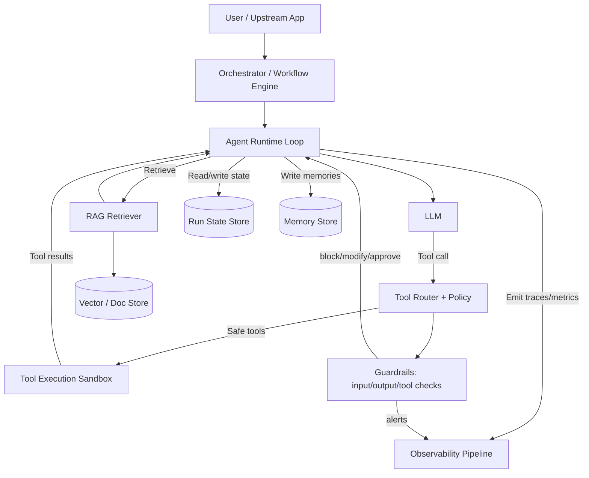

# Best Practices for LLM Agent Harnesses and Long-Horizon Generative AI Work

## Executive summary

“LLM agents” are best understood as language models operating in a loop, using tools and environment feedback to make progress toward goals rather than producing a single, stateless response. citeturn10search3turn9search12 A **harness** (also called scaffolding/runtime) is the production system around the model that makes this loop reliable: orchestration, tool execution, state persistence, retrieval, guardrails, evaluation, and observability. citeturn9search10turn4search0turn5search0turn2search4

Across research papers, official platform docs, and mature open-source stacks, there is strong convergence on a few “current best practices” for getting **reliable, productive work over longer time horizons**:

First, **start with the smallest architecture that can work**: a single agent plus a carefully-designed toolset and strong evaluation/observability. This reduces failure surface area and makes iteration tractable; multi-agent orchestration becomes worthwhile only when you can name clear specialization boundaries and measure gains. citeturn10search4turn7search0

Second, **treat tools as an API product**, not merely functions. The highest-leverage work is in tool naming, schemas, return payload design, and making tool outputs “model-friendly” (structured, compact, unambiguous). This sharply improves tool selection accuracy and reduces cascading errors over multi-step runs. citeturn0search0turn0search1turn0search5

Third, **long-horizon success depends more on state management than on raw model capability**. The common winning pattern is a multi-tier memory strategy: (1) short-term working context, (2) an explicit structured “run state” persisted after each step, plus (3) long-term recall via retrieval (vector search or document search) and curated summaries. Durable execution and resumability prevent rework and enable human approvals without losing context. citeturn7search2turn3search1turn3search3turn0search11turn10search0

Fourth, **planning and decomposition should be treated as search under cost constraints**. Chain-of-thought prompting can boost reasoning quality; tree/graph search over candidate “thoughts” can improve harder planning problems, but it increases latency/cost and creates more surfaces for self-consistency failures. The most practical planning approaches in production are usually “plan-then-execute with continuous tool-grounded checkpoints,” not unconstrained long autonomous chains. citeturn6search0turn1search1turn6search2turn10search3

Fifth, **reliability is engineered via verification loops**: grounding answers in tool outputs or retrieved documents; structured validators; selective human-in-the-loop for irreversible steps; and consensus/ensembling for critical decisions. Research shows that interleaving reasoning with actions (ReAct), self-consistency, and reflection-style memory can reduce hallucination and improve task success, but only when the harness supplies strong “ground truth” feedback and stopping conditions. citeturn1search0turn6search1turn1search3turn10search3

Sixth, **you cannot manage what you cannot see**. Production agent harnesses need end-to-end traces across model calls, tool calls, retrieval, and guardrails—ideally emitted in a standard telemetry format. Modern practice increasingly aligns with tracing-first systems and emerging telemetry standards for GenAI. citeturn4search0turn4search2turn4search1

Finally, **security and safety are not “prompt additions”**. Tool-using agents enlarge the attack surface (prompt injection, indirect injection via tool outputs, data exfiltration, excessive agency, denial of service). Current consensus guidance emphasizes least-privilege tooling, sandboxed execution, strong rate limiting, injection defenses, and guardrails that can intervene before and after tool execution. citeturn4search3turn5search20turn5search2turn5search1turn5search0

## Definitions and scope

A practical definition of an agent is: **an LLM system that iteratively selects actions (often tool calls), observes results from the environment, updates its internal state, and continues until a stopping condition is met**. This framing appears consistently across agent research and production docs: agents “use tools based on environmental feedback in a loop,” and strong implementations emphasize grounding each step in tool results or other feedback signals. citeturn10search3turn9search12turn1search0

An **LLM agent harness** is the **application and infrastructure layer that operationalizes that loop** safely and reliably. Concretely, a harness typically includes:

- **Orchestration**: a control structure for multi-step execution (simple loop, state machine/graph, workflow engine), plus retries and stop conditions. citeturn7search2turn10search3
- **Tool interface + execution runtime**: tool definitions/schemas, routing, timeouts, sandboxing, and error normalization so the model receives consistent feedback. citeturn0search0turn0search4turn0search1
- **State and memory**: short-term context management (what fits in the model context) plus persisted run state and long-term recall. citeturn3search3turn7search2turn10search0turn3search1
- **Retrieval augmentation**: connecting the agent to external knowledge (documents/DB/search) and passing retrieved context into decisions to reduce hallucination and keep information fresh. citeturn3search0
- **Reliability mechanisms**: verification, validators, self-checks, consensus, and human approvals for sensitive actions. citeturn10search0turn6search1turn10search3
- **Evaluation + observability**: offline evals, production monitoring, and traceability of every step. citeturn2search0turn2search4turn4search0turn4search2
- **Safety guardrails**: policies and enforcement around what the agent is allowed to do, what data it can access, and what actions require explicit review. citeturn5search0turn4search3turn5search20

This scope is intentionally broader than an “agent prompt.” The key insight from modern guidance is that **agent behavior emerges from the coupled system** (model + tools + state + control flow + feedback), so correctness and safety must be designed at the harness level. citeturn10search3turn2search4

## Architectural patterns

Agent harness architecture has converged around a small set of composable patterns, each with clear trade-offs.

**Single-agent loop with incremental capabilities** is widely recommended as a default: add tools gradually, keep the surface area measurable, and avoid premature multi-agent complexity. citeturn10search4turn10search1 The main downside is that as scope grows, prompts, tool lists, and memory strategies can become tangled—raising latency and increasing tool-selection errors unless you aggressively modularize tools and state.

**Multi-agent orchestration** introduces specialization (planner vs executor vs reviewer, or domain-specific subagents). Frameworks treat delegation/handoffs as first-class constructs and commonly implement handoffs as tool calls. citeturn9search13turn7search0 Benefits include compartmentalization (separate contexts, clearer responsibilities) and parallelizable work; costs include coordination overhead, emergent failure modes (agents convincing each other), and harder evaluation because the system has more degrees of freedom. citeturn7search0turn2search3

**Graph/state-machine orchestration with durable execution** has become a pragmatic middle ground for long-horizon work: represent the agent run as steps with saved state; resume without repeating completed work even after long delays; and support human inspection/modification of state. citeturn7search2turn10search9 This pattern explicitly treats the harness as a workflow engine, not a chat loop.

**Tool use and tool design** is a dominant determinant of real-world reliability. Official guidance emphasizes clear schemas and minimizing unnecessary tools; engineering guidance emphasizes namespacing, returning meaningful context, and token-efficient, structured tool outputs. citeturn0search0turn0search1turn0search5 When tool libraries grow large, techniques like tool search/dynamic tool loading can reduce overhead, but this shifts complexity into tool discovery and policy enforcement. citeturn0search0

**Retrieval-augmented generation (RAG)** is the canonical grounding pattern: retrieve relevant passages from a non-parametric store and condition generation on them. The original RAG formulation explicitly motivates retrieval for factuality, provenance, and updatable knowledge compared with parametric memory alone. citeturn3search0 In agent harnesses, RAG is often used both for “world knowledge” and for “memory retrieval” (prior decisions, user preferences, project state).

### Reference architecture diagram



Implementation note: in mature deployments, **run state** (SS) and **long-term memory** (MS) are deliberately separated. Run state is for correctness and resumability; memory is for recall and personalization. Mixing them tends to cause “state drift” and hard-to-debug regressions over time. citeturn7search2turn10search0turn3search1

## Memory and state management

Long-horizon productivity is constrained by context windows, non-determinism, and the cost of re-deriving intermediate work. Current best practice is to design **memory as a tiered system** rather than as “chat history in the prompt.”

**Short-term memory (thread-scoped)** usually means the current conversation/task context and recent tool outputs. Some frameworks treat this explicitly as agent “state” that updates each step and is loaded at step start. citeturn3search3 The main failure mode is unbounded growth (token bloat), which increases latency/cost and can degrade reasoning by flooding the model with irrelevant details.

**Compression and summarization** are now treated as first-class mechanisms, not hacks. “Context engineering” practices emphasize summarizing and compressing history while preserving decisions, constraints, unresolved issues, and other “load-bearing” facts. citeturn0search11 Similarly, “whiteboard” or structured short-term memory extracts requirements, decisions, and actions into a compact representation that survives chat truncation. citeturn0search8

**Persistent run state** is distinct: it is the canonical record of what the agent has done and what remains. Durable execution patterns persist state per step and allow resuming without reprocessing, even after long time gaps. citeturn7search2 Human-in-the-loop systems also depend on serializable run state to pause and safely resume after approvals. citeturn10search0turn10search2

**Long-term memory** typically uses (a) extraction into structured records plus (b) retrieval mechanisms (embedding-based search, doc search) for selective recall. Work like MemGPT explicitly frames this as managing memory tiers, borrowing the idea of a memory hierarchy to “provide the illusion of larger context resources” than the model window. citeturn3search1

**RAG as memory and grounding** remains central: retrieve relevant snippets (from documents, prior runs, or curated memories) and include them as evidence. The original RAG paper motivates retrieval for improved factuality and the ability to update knowledge without retraining. citeturn3search0

### Memory/storage options compared

| Option | What it stores | Best for | Pros | Cons / failure modes | Implementation notes |
|---|---|---|---|---|---|
| In-context transcript (raw messages + tool outputs) | Full recent history | Short tasks; debugging | Highest fidelity; simplest | Token bloat; can degrade performance due to irrelevant context; expensive at scale citeturn3search3 | Enforce hard token budgets; aggressively trim tool outputs and logs; keep only “decision-relevant” artifacts citeturn0search11turn0search1 |
| Rolling summary / “whiteboard” | Extracted requirements, decisions, actions | Long chats; project continuity | Compact; preserves key commitments citeturn0search8turn0search11 | Summaries can silently drop constraints or introduce errors; may become stale | Use update rules (append + reconcile), not full rewrite; store provenance (source message IDs) to audit summary drift citeturn0search11 |
| Structured run state (JSON/schema) | Canonical state of workflow step outputs | Long-horizon tasks; resumability | Deterministic resume; enables HITL; supports retries without “starting over” citeturn7search2turn10search0 | Schema mismatches; partial updates; concurrency conflicts | Treat tools as idempotent; version state schema; write state after each successful step; record tool errors as data (not only logs) citeturn10search0turn10search8 |
| Vector store “memory” | Embedded chunks + metadata | Preference recall; episodic facts; semantic search | Scales recall; tolerant to paraphrase; easy to plug into RAG citeturn3search0 | Hallucinated recall if retrieval is weak; privacy issues if sensitive data embedded | Use metadata filters (user, project, time); de-duplicate; set TTL for volatile items; store exact text alongside embeddings for audit citeturn3search0 |
| Document store + RAG retrieval | Source-of-truth docs, policies, code, tickets | Grounded answers; enterprise knowledge | Evidence-based outputs; easier compliance/audit citeturn3search0 | Requires ingestion pipelines; stale indexes; chunking errors | Decide chunking strategy (semantic vs fixed); evaluate retriever and generator separately; log retrieved passages for later analysis citeturn2search4turn8search6 |
| “Memory OS” tiering (MemGPT-style) | Multiple tiers with control flow | Very long-running assistants | Explicitly manages limited context; supports interrupts citeturn3search1 | Higher harness complexity; more moving parts to evaluate | Treat memory policies as code + evals; instrument memory reads/writes as first-class events in traces citeturn3search1turn4search2 |

Concrete recommendation: for long-horizon work, **persist structured run state for correctness** and **use retrieval-based memory for recall**, but do not let retrieval memory overwrite run state unless a validator/human confirms. This separation prevents “memory contamination” from silently changing what the system believes it already did. citeturn7search2turn10search0turn3search1

## Planning and decomposition

Planning in agent harnesses is best framed as: **choose the next action under uncertainty, budget, and safety constraints**. Two broad families dominate:

**Prompted reasoning strategies**: chain-of-thought prompting is a simple technique that improves complex reasoning in sufficiently capable models by eliciting intermediate steps. citeturn6search0 A key limitation is that more reasoning tokens can also mean more opportunities to drift or rationalize errors; planning still needs grounding in external feedback.

**Search over candidate plans/thoughts**: Tree of Thoughts generalizes chain-of-thought by exploring multiple candidate reasoning paths and using self-evaluation/backtracking to make more global choices. citeturn1search1 Graph of Thoughts generalizes further to arbitrary dependency graphs across “thought units.” citeturn6search2 These methods can meaningfully improve performance on tasks requiring deliberation, but the harness must manage exponential growth: define branching factors, evaluation heuristics, and strict stop/timeout policies.

**Classical planning analogs** remain useful vocabulary for harness builders. In hierarchical task network (HTN) planning, complex tasks are decomposed into subtasks until primitives are reached—matching the common engineering instinct to create “task trees” of calls and validations. citeturn6search3 The main practical value is not to implement a full planner, but to adopt HTN-like discipline: explicit task schemas, decompositions, and pre/postconditions.

**Practical production pattern**: plan at a coarse level, then execute step-by-step with tool-grounded checkpoints and the ability to revise the plan when evidence contradicts assumptions. This aligns with guidance that agents should obtain “ground truth” from the environment at each step and enforce stopping conditions (iteration limits, blockers). citeturn10search3

Concrete recommendations for long-horizon planning:

- Use **budgeted planning**: explicitly cap planning depth/branches and store the plan as state so it can be reviewed, diffed, and resumed. citeturn7search2turn10search0
- Prefer **tool-grounded milestones**: plans should name which tools will confirm progress (tests pass, record updated, document retrieved), not only natural-language intentions. citeturn10search3turn1search0
- Separate **planner vs executor** roles when tasks are large: one component generates/updates the plan; another executes with strict schemas and retries. This is often simpler than a full multi-agent crowd and improves debuggability. citeturn7search0turn10search3

## Reliability techniques

Reliability engineering for agent harnesses is the discipline of preventing (and recovering from) the characteristic failures of multi-step LLM systems: hallucinated facts, tool misuse, runaway loops, state drift, brittle parsing, and “false progress.”

The most common and effective techniques fall into a few categories:

**Grounding via tools and retrieval**: ReAct shows that interleaving reasoning with actions (e.g., querying a knowledge source) can reduce hallucination and error propagation compared with pure chain-of-thought reasoning, especially on tasks that benefit from external evidence. citeturn1search0 RAG similarly grounds outputs by conditioning on retrieved passages rather than parametric memory alone. citeturn3search0

**Verification loops and self-consistency**: self-consistency replaces greedy decoding by sampling diverse reasoning paths and selecting the most consistent answer, improving reasoning accuracy on multiple benchmarks. citeturn6search1 In harness terms, this corresponds to “N-sample and vote/re-rank”—powerful but costlier, so it should be selectively applied to high-impact decisions.

**Reflection and self-debugging**: Reflexion stores linguistic feedback/reflections in an episodic memory buffer to improve future trials without changing weights, aligning with the harness pattern “write down what went wrong, then try again with that lesson visible.” citeturn1search3 For software tasks, systems like SWE-agent emphasize agent-computer interfaces and iterated execution grounded in the actual repo/test environment, highlighting that “execution is the verifier.” citeturn2search20

**Human-in-the-loop (HITL) approvals**: modern harnesses increasingly operationalize HITL as an interrupt/resume mechanism rather than a vague “review step.” Tools can declare they require approval; runs can be paused with serialized run state and resumed after a decision. citeturn10search0turn10search8 This reduces catastrophic failures on irreversible actions (payments, deletions, production deploys) at the cost of latency and workflow complexity.

**Guardrails as a parallel control plane**: guardrails validate inputs/outputs and can route requests to cheaper/faster checks (e.g., “is this off-topic?”) before investing in more expensive reasoning. citeturn5search0 This pattern ties directly to cost control and abuse prevention in production.

### Reliability flow for long-horizon tasks

```mermaid
flowchart TD
  S[Start / Resume from state] --> P[Plan (budgeted)]
  P --> G[Gather evidence: retrieve + tool queries]
  G --> E[Execute next step (tool calls)]
  E --> V[Verify: validators + consistency checks]
  V -->|pass| C[Commit step outputs to run state]
  C --> N{Done or budget hit?}
  N -->|done| F[Finalize output + provenance]
  N -->|continue| P

  V -->|fail| R[Repair: re-prompt / reflect / try alternate]
  R --> E

  E -->|sensitive action| H[Interrupt for human approval]
  H -->|approve| E
  H -->|reject| R

  N -->|budget hit| STOP[Stop safely + ask for input]
```

Key implementation notes:

- **Always encode explicit stopping conditions** (max iterations, time budget, max tool calls). This is consistently recommended to maintain control and avoid runaway loops. citeturn10search3turn9search12
- Treat tool failures as first-class outputs: return structured errors to the model so it can reason about recovery, rather than failing silently in logs. citeturn0search1turn10search8
- Use **selective escalation**: apply self-consistency, extra verification, or human review only when the risk/cost is justified by the action. citeturn6search1turn10search0turn5search0

## Evaluation and observability

Evaluation is not optional for long-horizon agents because these systems are stochastic and can regress in subtle ways when you change prompts, tools, retrieval, or models. Official evaluation guidance emphasizes designing evals that reflect production behavior and iterating based on measured failures. citeturn2search4turn2search0 Agent-focused evaluation guidance likewise highlights that eval value compounds over the lifecycle of an agent and prevents reactive production firefighting. citeturn10search6

### Evals: what to measure

For harnesses, you generally need **three layers** of metrics:

- **Outcome metrics**: task success rate, correctness, user satisfaction.
- **Process metrics**: tool-call accuracy, steps-to-success, retry rates, human interventions, state corruption incidents.
- **Resource metrics**: latency, tokens, dollar cost, tool compute time, queue time.

Benchmarks illustrate why agent evals must go beyond static QA: GAIA explicitly targets tool-use proficiency and real-world assistant behaviors; AgentBench evaluates LLMs as agents across multiple interactive environments; SWE-bench-style tasks evaluate repo-level software changes where correctness is measured by tests. citeturn2search2turn2search3turn2search20turn2search1

### LLM-based evaluators and their limits

LLM-as-a-judge approaches can scale subjective evaluation (style, helpfulness) and correlate well with humans in some settings, but they have known biases (position/verbosity/self-enhancement). citeturn8search1 G-Eval proposes structured form-filling with chain-of-thought to improve alignment with human judgments, while still noting evaluator biases. citeturn8search0turn8search4

For RAG and grounded assistants, evaluation frequently decomposes into retriever and generator quality. Tooling like RAG triad metrics (context relevance, groundedness, answer relevance) and metric suites like Ragas formalize this decomposition. citeturn8search3turn8search6turn8search17

### Observability: traces, standards, and practice

For production, traces are essential: “what did the agent do, in what order, with what tool outputs, under what guardrails, and why did it fail?” Tracing systems model agent runs as traces/spans, enabling step-level diagnosis. citeturn4search0turn4search1

A notable “current” best practice is aligning instrumentation with emerging standard telemetry vocabularies for GenAI, enabling vendor-neutral pipelines and consistent dashboards across stacks. citeturn4search2

### Evaluation metrics comparison table

| Metric | What it captures | How to measure in a harness | Pros | Cons / pitfalls |
|---|---|---|---|---|
| Task success rate | End-to-end correctness | Gold labels; unit/integration tests; human grading | Directly tied to value citeturn2search4turn2search20 | Expensive labels; brittle if tasks shift |
| Step success / tool-call accuracy | Whether actions are correct | Compare tool args to expected; schema validation; replay logs | Pinpoints failure stage citeturn0search0turn2search16 | Requires ground truth; tool specs evolve |
| Groundedness / faithfulness | Hallucination relative to evidence | Judge if answer is supported by retrieved context | Targets factual risk in RAG citeturn8search17turn8search3 | “Judge” may be biased; retrieval may omit true info |
| Latency (p50/p95) | User experience + scalability | Trace timestamps across steps | Operationally critical citeturn4search2turn4search0 | Must attribute where time is spent (model vs tools vs queue) |
| Cost (tokens + tool compute) | Unit economics | Token accounting + tool runtime costs | Enables cost/perf tuning citeturn5search8turn2search4 | Easy to optimize cost while degrading quality |
| Human intervention rate | Oversight burden | Count interrupts/approvals/edits | Measures autonomy vs risk trade-off citeturn10search0turn10search17 | Low intervention may mean undetected failures |
| Calibration (ECE/Brier) | Whether confidence tracks correctness | Compare stated/derived confidence vs outcomes | Supports selective answering, routing, risk control citeturn13search0turn13search2 | LLM self-confidence can be poorly calibrated; depends on elicitation method |
| LLM-as-judge score | Subjective quality proxy | Use a strong judge model with rubric | Scales subjective evals citeturn8search1turn8search0 | Biases; judge drift; needs spot-checking |

### Conceptual charts for metric trade-offs

The following mermaid charts are **illustrative** (conceptual), intended to help reason about trade-offs; they are not empirical measurements.

```mermaid
xychart-beta
  title "Conceptual trade-off: reliability vs cost"
  x-axis "Relative Cost" [1,2,3,4,5]
  y-axis "Relative Reliability" 0 --> 100
  line "Single prompt" [40, -, -, -, -]
  line "RAG grounding" [55,65, -, -, -]
  line "Agent + verification loop" [60,72,80, -, -]
  line "Agent + self-consistency / consensus" [60,75,85,92,95]
```

```mermaid
xychart-beta
  title "Conceptual trade-off: latency vs robustness (with HITL)"
  x-axis "Relative Latency" [1,2,3,4,5]
  y-axis "Robustness to high-risk actions" 0 --> 100
  line "No HITL" [40, -, -, -, -]
  line "Selective HITL (sensitive tools)" [55,70,80,90,95]
```

## Safety and guardrails

Tool-using agents expand safety and security risk because **natural language becomes an instruction channel** that can manipulate tool calls, data access, and irreversible actions. The security community has codified major classes of risk (prompt injection, insecure output handling, model DoS, supply chain issues, excessive agency, etc.). citeturn4search3turn4search10 Prompt injection guidance emphasizes that models often do not reliably separate “instructions” from “data,” which makes indirect injection (through retrieved docs or tool outputs) a central threat in agentic systems. citeturn5search20turn5search2

A risk-management-aligned harness typically incorporates:

- **Access control and least privilege**: expose only the minimum tools and minimum data needed for the task; scope credentials per user/project; separate read vs write tools. This directly reduces the blast radius of injections and model mistakes. citeturn4search3turn5search20
- **Sandboxing for execution tools**: run code execution, shell, or file-system tools in isolated environments; normalize outputs; and treat timeouts as safe failures. citeturn0search4turn10search8
- **Guardrails as enforceable checks** on both input and output, including policy-based routing (cheap model checks before expensive actions) and structured validation. citeturn5search0turn5search3
- **Rate limiting and abuse resistance**: automatic retries with exponential backoff, token budgeting, and safeguards against “model denial of service” patterns. citeturn5search1turn5search8turn4search3
- **Human approvals for irreversible actions**: implement interrupt/resume with persisted run state, so sensitive tool calls require explicit approval and can be audited. citeturn10search0turn10search2
- **Governance and risk posture alignment**: map agent risks and mitigations to an organizational framework (e.g., generative AI risk profiles) and document controls and monitoring. citeturn5search10turn5search6

A concise safety checklist aligned with current guidance:

1) Assume **every tool output is untrusted input** (especially web content, retrieved documents, emails/tickets). citeturn5search20turn5search2
2) Enforce a **tool policy layer** that can block or require approval based on tool type, arguments, and context. citeturn10search8turn10search0
3) Log and trace everything needed for incident response (which prompt, which retrieval results, which tool args, which outputs). citeturn4search2turn4search0
4) Evaluate adversarially: red-team prompt injection and tool misuse because “prompt injection is far from a solved problem,” especially as models take real-world actions. citeturn5search2turn4search3

In this area, it is worth explicitly anchoring to community standards and guidance such as entity["organization","OWASP","security foundation"] recommendations for LLM application risks, and to cross-sector risk frameworks such as the entity["organization","NIST","us standards agency"] generative AI profile. citeturn4search3turn5search10turn5search21

## Deployment considerations, frameworks, case studies, and gaps

### Deployment and operations

Long-horizon agents behave more like distributed systems than chatbots: they have retries, external dependencies, queuing, and partial failures. Deployment best practices therefore center on concurrency, idempotency, and cost control.

- **Concurrency and async I/O**: agent runtimes that perform many tool/LLM calls benefit from asynchronous execution and correct concurrency configuration, otherwise infrastructure is underutilized and latency spikes. citeturn0search15
- **Durable execution and resumability**: persist step state so failures do not cause full restarts, and so long-running tasks can resume after hours/days. citeturn7search2turn10search0
- **Cost optimization**: reduce prompt bloat (trim tool outputs, compress context), keep tool definitions small, and minimize tool count; some tool-use guidance explicitly recommends small tool libraries used frequently rather than large tool catalogs. citeturn0search5turn0search11turn0search0
- **Model selection and routing**: use cheaper models for guardrails or lightweight checks and reserve expensive reasoning for steps where it changes outcomes; guardrail docs explicitly present this as a cost/safety pattern. citeturn5search0

### Fine-tuning vs prompting vs retrieval

Current consensus guidance emphasizes: **set up evals first**, then choose the adaptation lever based on what you need.

- Retrieval (RAG) is a strong default when you need grounding in private or frequently-updated data and want provenance; this is a core motivation in both RAG research and industry guidance. citeturn3search0turn11search4
- Supervised fine-tuning can help when you need consistent behavior for a well-defined format/task, but official guidance warns to establish evals first so you can prove improvement over a base model. citeturn12search5turn12search0
- Model optimization guidance frames fine-tuning as a way to make a model excel at your application’s expected inputs/outputs, but it does not remove the need for harness reliability (tools, state, guardrails). citeturn12search3turn2search4

### Framework landscape comparison

Below is a pragmatic comparison of widely-used open-source harness/framework options (not exhaustive). The goal is not “which is best,” but “which primitives are mature” for long-horizon reliability.

| Framework / approach | Core abstraction | Strengths for long-horizon work | Trade-offs / risks | Primary-source anchors |
|---|---|---|---|---|
| LangChain + LangGraph | Agent graphs + persisted state | Durable execution; explicit state + checkpointing; human-in-the-loop and memory as first-class features citeturn7search2turn10search9turn3search3 | Added conceptual overhead vs a simple loop; requires discipline to avoid state sprawl | citeturn7search2turn10search9turn3search3turn4search1 |
| OpenAI Agents SDK | Minimal primitives: tools, handoffs, tracing, guardrails, HITL | Integrated tracing; explicit handoffs; guardrails; approval-based HITL with serializable RunState citeturn4search0turn9search13turn5search0turn10search0 | Still requires you to design your state model, tool contracts, and eval strategy | citeturn5search11turn4search0turn10search0turn5search0 |
| AutoGen | Multi-agent conversation framework | Strong multi-agent patterns; conversation-driven orchestration and human feedback loops citeturn7search0turn7search4 | Multi-agent systems are harder to debug/evaluate; shared-state patterns can become complex | citeturn7search0turn7search16turn7search8 |
| Microsoft Semantic Kernel agents | Tool invocation + planners + memory | Built-in memory patterns like “whiteboard” extraction; planner + embedding-based function filtering concepts citeturn0search8turn0search14turn0search16 | Requires careful design to avoid mixing chat history with canonical state; evolving APIs | citeturn0search8turn0search14turn0search16 |
| entity["organization","LlamaIndex","rag agent framework"] | Workflows + context/state objects | Explicit “Context” for maintaining state; agent workflows designed to be extended with persistence citeturn3search2turn3search6 | Needs strong eval discipline; workflow/state choices affect determinism | citeturn3search2turn3search6turn3search17 |
| entity["organization","Haystack","deepset framework"] | Pipelines + loop-based Agent component | Transparent agent loop with schema-validated runtime state and exit conditions citeturn9search12turn9search6 | Less “agentic magic” out of the box; you assemble components deliberately | citeturn9search12turn9search2turn9search6 |
| entity["company","CrewAI","multi-agent framework"] | Crews (agents) + flows | Explicit multi-agent orchestration; positions itself as production-ready with guardrails/memory/observability citeturn9search0turn9search4turn9search14 | Fast-moving ecosystem; architecture discipline still required to prevent “agent soup” | citeturn9search0turn9search4turn9search14 |
| entity["organization","Pydantic AI","python agent framework"] | Type-safe agent bundles (tools/hooks/instructions) | Strong schema enforcement mindset; built-in tool patterns including memory tools citeturn9search5turn9search1turn9search20 | Python-centric; long-horizon durability depends on your persistence/orchestration | citeturn9search5turn9search1turn9search20 |
| DSPy (program synthesis/optimization) | Declarative LM pipelines + compiler | Systematic pipeline optimization against metrics; encourages eval-driven iteration citeturn7search3turn7search7 | More “pipeline engineering” than autonomous agent design; needs good metrics and datasets | citeturn7search3turn7search7 |

### Case studies and what they teach

SWE-agent (and SWE-bench-family evaluations) demonstrates a critical harness lesson: in software engineering, **tool-grounded execution (running tests, applying patches) is the most reliable verifier**, and benchmarks that evaluate agents in realistic environments expose long-horizon weaknesses (state drift, planning errors, and brittle instruction following). citeturn2search20turn2search1

GAIA and AgentBench highlight that general assistant competence is not just “answer quality,” but multi-step tool use, browsing/retrieval, and robust interaction with environments. citeturn2search2turn2search3

### Gaps and risks

Despite best practices, several gaps remain active:

- **Benchmark contamination and overestimation**: recent work argues that public benchmarks can overestimate real performance due to contamination and benchmark artifacts, implying that harness builders should invest in private eval sets and telemetry-derived tasks. citeturn2search9turn2search5
- **Prompt injection remains unsolved at tool scale**: defenses are improving, but credible guidance stresses that indirect prompt injection is still a major risk as models take real-world actions. citeturn5search2turn5search20turn4search3
- **Self-evaluation and calibration limitations**: confidence estimation and calibration remain active research areas; surveys emphasize challenges and diverse methods, and long-form calibration is particularly hard. citeturn13search0turn13search2
- **Multi-agent complexity tax**: multi-agent orchestration can help, but it also complicates shared state, retries, conditional branches, and evaluation—often pushing teams toward graph-based orchestration and durable state as a stabilizing abstraction. citeturn7search8turn7search2turn10search9

### Concrete “current best practice” recommendations

A rigorous, implementation-oriented baseline for 2026 production harnesses looks like:

1) A workflow/orchestration layer with durable execution and a formal run-state schema. citeturn7search2turn10search0
2) A minimal, well-designed toolset with strict schemas, compact outputs, and explicit timeouts/errors. citeturn0search1turn0search0turn10search8
3) Tiered memory: compressed short-term + persisted run state + retrieval-based long-term recall, with clear separation between “truth state” and “recall memory.” citeturn3search3turn0search11turn3search1turn7search2
4) Verification loops: evidence retrieval, tool-grounded checks, selective self-consistency for high-impact decisions, and reflection-style repair when verification fails. citeturn1search0turn6search1turn1search3turn10search3
5) Human approval interrupts for irreversible actions and a policy layer that can block/require approval based on tool + args + context. citeturn10search0turn10search8
6) Evals and observability from the start: offline eval suites (including your own private tasks) plus tracing/metrics emitted for every run and step. Adopt standard telemetry semantics where possible for long-term operability. citeturn2search4turn10search6turn4search2turn4search0
